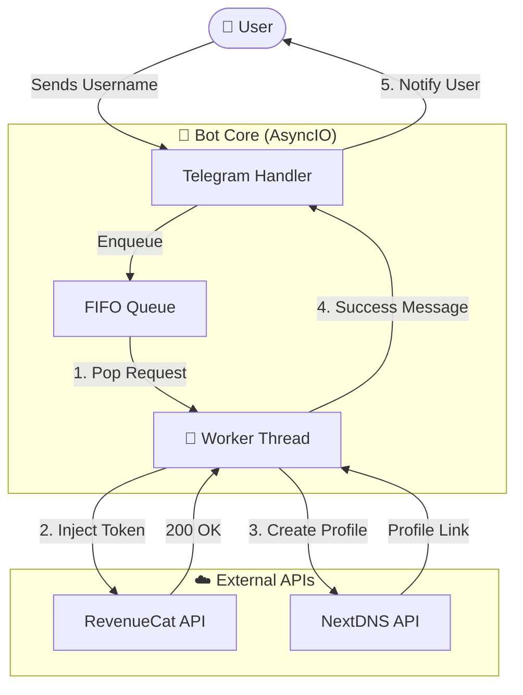

# 🚀 Locket Gold Activator Bot (Professional Edition)

<div align="center">

[](https://python.org)
[](https://core.telegram.org/bots)
[](https://docs.python.org/3/library/asyncio.html)
[](LICENSE)
[]()

**The most advanced, high-performance Telegram Bot for automating Locket Gold activation.**  
*Built with speed, security, and scalability in mind.*

[Why Choose This Bot?](#-why-choose-locket-gold-activator-bot) • [Features](#-key-features) • [Installation](#-installation) • [Configuration](#-configuration)

</div>

---

## 💎 Why Choose Locket Gold Activator Bot?

Unlike other basic scripts or tools, this bot is engineered as a **production-grade system**. It solves the common problems of slowness, API bans, and revocations.

| Feature | This Bot 🚀 | Standard Scripts ❌ |
| :--- | :--- | :--- |
| **Performance** | **Zero-Lag Async Core**. Handles thousands of users without freezing. | Single-threaded. Freezes while processing one user. |
| **Reliability** | **Round-Robin Token Rotation**. Distributes load to prevent bans. | Uses 1 token until it dies or gets rate-limited. |
| **Safety** | **Smart Anti-Revoke**. Auto-generates NextDNS profiles to block validation servers. | No protection. Gold disappears after a few hours/days. |
| **User Experience** | **Real-time Queue Updates**. Users know their exact position (`#1`, `#2`...). | Silent failure. Users don't know if it's working. |
| **Architecture** | **Worker Pool**. Scalable system (add 1 or 100 workers easily). | Simple loop. Cannot scale with demand. |

---

## 🌟 Key Features

### ⚡ **High-Performance Core**
*   **Fully Asynchronous**: Powered by `aiohttp` and `asyncio` for non-blocking I/O. The bot remains responsive to commands even under heavy load.
*   **Worker Pool System**: Configurable number of concurrent workers (`NUM_WORKERS`) to parallelize request processing.

### 🛡️ **Advanced Security**
*   **NextDNS Integration**: Automatically creates a unique DNS profile for each user that blocks `revenuecat.com`, ensuring the Gold subscription sticks.
*   **Strict Cooldowns**: Enforces a 45-second cooldown per token usage to mimic human behavior and avoid detection.

### 🤖 **Smart Automation**
*   **Auto-Resolution**: Just paste a Locket username or link; the bot handles UID resolution automatically.
*   **Queue Management**: FIFO (First-In-First-Out) queue system with live status updates to prevent API flooding.
*   **Admin Dashboard**: Powerful `/stats` command to monitor queue size, active workers, and success rates in real-time.

---

## 🛠️ Installation

### Prerequisites
*   Python 3.9+
*   Telegram Bot Token via [@BotFather](https://t.me/BotFather)
*   NextDNS API Key via [NextDNS Developer](https://my.nextdns.io/account) (optional)

### Automated Setup
We provide a **one-click setup script** that handles virtual environments and dependencies.

```bash
# 1. Clone the repository
git clone https://github.com/thanhdo1110/Locket-Gold.git
cd Locket-Gold

# 2. Run the setup script
chmod +x run.sh
./run.sh
```

---

## ⚙️ Configuration

Secrets are loaded from a `.env` file. Keep real values out of source control.

1. Copy the example environment file:
```bash
cp .env.example .env
```

2. Edit `.env` with your actual values:
```bash
# Required
BOT_TOKEN="YOUR_TELEGRAM_BOT_TOKEN_HERE"

# Optional NextDNS integration
NEXTDNS_KEY=""
NEXTDNS_ENABLED="false"

# Your Locket Gold Data
TOKEN_SETS_JSON='[
    {
        "fetch_token": "...",
        "app_transaction": "...",
        "hash_params": "...",
        "hash_headers": "...",
        "is_sandbox": false
    }
]'

# Worker count (concurrency)
NUM_WORKERS="1"

# Admin Telegram ID (for bypass and admin commands)
ADMIN_ID="YOUR_ADMIN_ID"
```

---

## 🎮 Commands

### User Commands
Use these commands in your Telegram bot:

| Command | Usage | Description |
| :--- | :--- | :--- |
| `/start` | - | Initialize the bot and show the main menu. |
| `/setlang` | - | Switch between English 🇺🇸 and Vietnamese 🇻🇳. |
| `/help` | - | View detailed help and instructions. |
| **Direct Message** | `username` | Send any Locket username or link to queue an upgrade. |

### Admin Commands (👑)
Restricted to the `ADMIN_ID` configured in `config.py`.

| Command | Usage | Description |
| :--- | :--- | :--- |
| `/stats` | - | View **Queue Size**, Active Workers, and System Health. |
| `/noti` | `/noti <msg>` | Broadcast a message to **all** bot users. |
| `/rs` | `/rs <id>` | Reset the daily limit for a specific user ID. |
| `/setdonate` | Reply to photo | Set the custom "Success" image shown after activation. |

---

## 📊 System Architecture



---

## ⚠️ Disclaimer

> **This project is for EDUCATIONAL and RESEARCH purposes only.**  
> The author is not responsible for any misuse of this software. By using this tool, you agree to take full responsibility for your actions. "Locket Widget" and "RevenueCat" are trademarks of their respective owners.

---

<div align="center">

**[ Report Bug ](https://github.com/thanhdo1110/Locket-Gold/issues) • [ Request Feature ](https://github.com/thanhdo1110/Locket-Gold/issues)**

Made with ❤️ by [Thanh Do](https://github.com/thanhdo1110)

</div>
